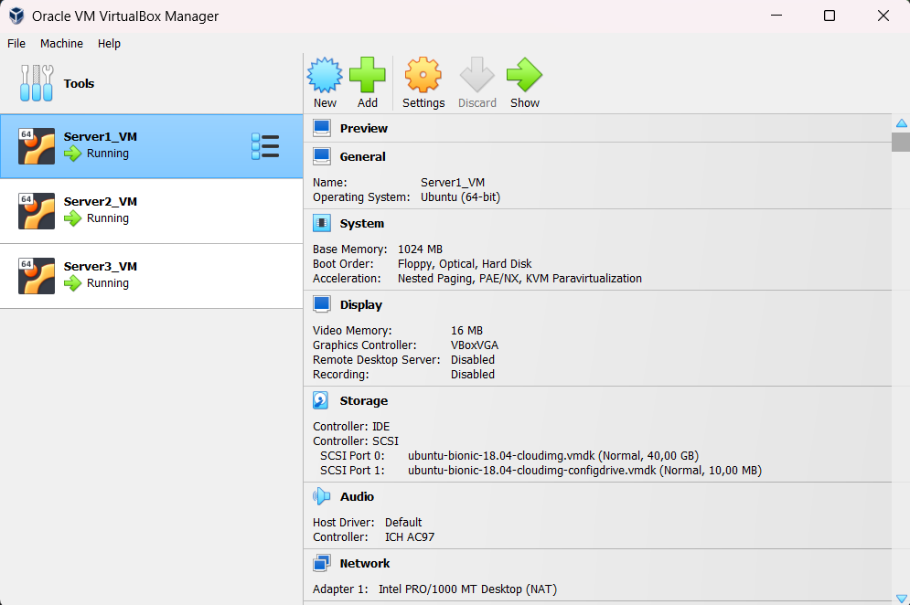

# Setting Up Multiple Servers Locally Using Vagrant

Conducting experiments that require multiple servers can be quite challenging, especially when faced with the need for powerful servers or when we have to rent cloud providers like EC2 (Elastic Compute Cloud) from AWS, Google Cloud Compute Engine (GCE), Microsoft Azure Virtual Machines (VMs), IBM Cloud Virtual Servers, DigitalOcean Droplets, Linode, and other similar products. 

As an initial step, it is advisable to first conduct experiments in a local environment before applying them to the actual server environment. This time, we will explain how to set up three servers simultaneously using a Vagrantfile script. 

The specifications for each server are as follows: 
- <b>Server 1</b>: 1024MB of RAM, 500m CPU, and 40GB of Disk; 
- <b>Server 2</b>: 2048MB of RAM, 1000m CPU, and 30GB of Disk; and 
- <b>Server 3</b>: 512MB of RAM, 250m CPU, and 25GB of Disk. 

For this experiment, we will use the `ubuntu/bionic64` box, although there are other box options available, which can be viewed at the following link: https://portal.cloud.hashicorp.com/vagrant/discover?query=ubuntu

```
Before you begin, make sure Vagrant and VirtualBox are installed on your computer
```
- [Vagrant](https://www.vagrantup.com/)
- [VirtualBox](https://www.virtualbox.org/)

```ruby
# To start, the command vagrant destroy -f can be used to destroy any previous virtual machines
$ vagrant destroy -f 

# followed by vagrant up to start building new servers
$ vagrant up
```

```ruby
$ vagrant up

Bringing machine 'server1' up with 'virtualbox' provider...
Bringing machine 'server2' up with 'virtualbox' provider...
Bringing machine 'server3' up with 'virtualbox' provider...
==> server1: Importing base box 'ubuntu/bionic64'...
==> server1: Matching MAC address for NAT networking...
==> server1: Checking if box 'ubuntu/bionic64' version '20230607.0.5' is up to date...
==> server1: Setting the name of the VM: Server1_VM
==> server1: Clearing any previously set network interfaces...
==> server1: Preparing network interfaces based on configuration...
    server1: Adapter 1: nat
==> server1: Forwarding ports...
    server1: 22 (guest) => 2222 (host) (adapter 1)
==> server1: Running 'pre-boot' VM customizations...
==> server1: Booting VM...
```

Wait for the process to complete, and once done, the three servers have been successfully deployed

